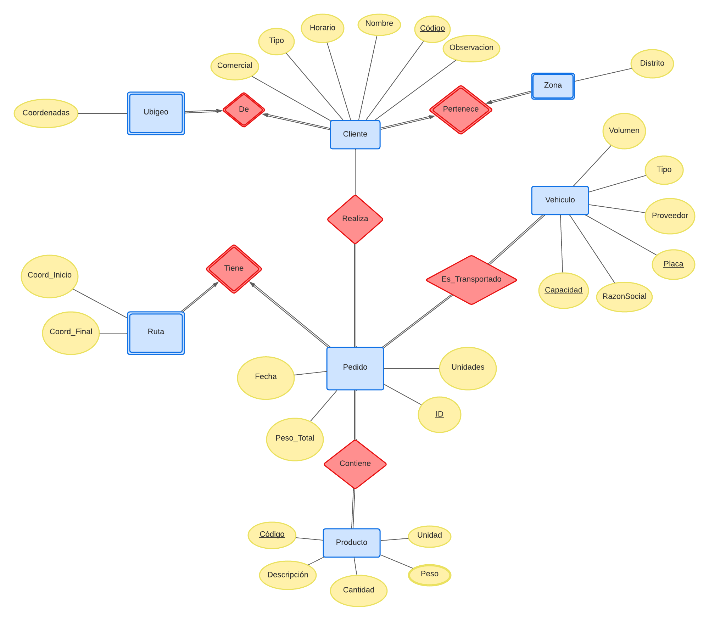

# 🧠 NeuroPump AI

</img> 

## 🎓 Equipo
- Kalos Lazo Mera [202210184]
- Carlos Alejandro Colfer Mendoza [202210096]
- Vasco Díaz Hurtado [202210119]

## 📝 Descripción

Oregon Foods Perú es una empresa líder en la distribución e importación de alimentos premium en el mercado peruano. Su enfoque principal es abastecer tanto a tiendas individuales como a reconocidas cadenas de supermercados como Wong, Vivanda, Metro, entre otros. Con el fin de garantizar un suministro eficiente, la empresa cuenta con múltiples flotas terrestres que pueden ser rastreadas en tiempo real.

Lima, la capital de Perú, se caracteriza por tener uno de los tráficos más intensos del país, lo cual representa un desafío para Oregon Foods Perú en términos de capacidad de abastecimiento y tiempos de respuesta. Conscientes de esta problemática, un grupo de estudiantes del tercer ciclo de Ciencia de la Computación fundaron NeuroPump AI, una start-up especializada en Inteligencia Artificial y Deep Learning.

La solución propuesta por NeuroPump AI se basa en el uso de algoritmos de Backpropagation, los cuales permiten entrenar un modelo para obtener resultados óptimos al modificar los pesos individuales del sistema. Además, se utiliza el conocimiento sistémico actual, que incluye experiencia en rutas, alternativas de rutas, desvíos no conocidos y horas recomendadas de entrega, entre otros aspectos relevantes.

Para acceder a información en tiempo real, se emplean las API (Application Protocol Interface), que facilitan el consumo de microservicios web, tales como el estado del tráfico, lecturas de autopistas y reportes de accidentes automovilísticos. Esta integración con los recursos de servidores web permite que el servicio de distribución de alimentos de Oregon Foods Perú sea más eficiente.

Por otro lado, NeuroPump AI desarrollara una aplicación web que le ofrecerá a Oregon Foods una interfaz intuitiva para que su personal pueda registrar los pedidos de manera eficaz. Esta aplicación web tiene como objetivo principal optimizar el uso del sistema de base de datos actual, reemplazando la antigua hoja de cálculo de Excel utilizada anteriormente.

 La aplicación web permite a Oregon Foods Perú mantener actualizados sus catálogos de productos, información de clientes y datos de proveedores, los cuales pueden ser consultados y actualizados desde cualquier dispositivo, ya sea un escritorio o un dispositivo móvil, brindando comodidad y accesibilidad tanto en el lugar de trabajo como en el hogar.

## ⚙️ Requisitos
A continuación se detallaran los principales requisitos de acuerdo a los actores involucrados. Es fundamental para el desarrollo de nuestro proyecto respetar nuestros objetivos, pues de ello depende el éxito del proyecto. Cabe mencionar que a medida que se esté desarrollando surgirán nuevas consideraciones e incluso modificaciones a la establecidas.

#### Oregon Foods
- Número de Camiones.
- Capacidad de cada tipo de camión.
- Puntos de distribución correspondientes a cada camión.
- Franja horaria de entrega.
- Estimado de tiempo de entrega.
- Rutas previamente empleadas.
#### NeuroPump AI
- Implementar APIs que se adapten al contexto de la problemática. Estas deben ser capaces de leer datos de tráfico y rutas eficientes en tiempo real.
- Empleo del concepto POO (programación orientada a objetos).
- Empleo del algoritmo Backpropagation.
- Empleo de conceptos matemáticos relacionados con inteligencia artificial (Grafos).
- Utilizar mecanismos propios de C++ como: Uso de plantillas de funciones, algoritmos, librería STDL, análisis BigO para medir el consumo de recursos. 

## 🎯 Objetivos
1. Desarrollar una correcta implementación del algoritmo de backpropagation para resolver problemas de rutas más eficientes.

2. Considerar incorporar un desarrollo front-end con buen UI, facilitando el uso portátil por medio de los usuarios.

3. Consumir algún tipo de API confiable, para obtener datos en tiempo real que sirvan como indicadores de ajuste de pesos en nuestro algoritmo.

## 🚀 Producción
#### PostgreSQL
Para poder correr la aplicación en PostgreSQL de manera local necesitamos crear nuestra base de datos, de la siguiente forma `CREATE DATABASE dev_oregon_db;`. Posteriormente debemos considerar crear un ambiente virtual dentro de python para correr el gestor de tablas, tal que `python3 -m veenv env`, siendo `env` el ambiente virtual.

## 💽 Componentes
#### User Interface (UI)
Usaremos una aplicación web cuyo fin será agregar los nuevos productos que Oregon Foods Perú comercializará. Crearemos un formulario en HTML que se conectará con la base de datos para que los nuevos productos sean directamente agregados a la misma. La interfaz estará construida con la combinación de HTML, CSS, Python y JavaScript. HTML creará la interfaz en lenguaje marcado de hipertexto, CSS se encargará de darle un diseño agradable a la vista, Python será el encargado de configurar las librerías necesarias para poder conectarse a la base de datos y JavaScript servirá para programar todas las funciones necesarias en la interacción del usuario con la aplicación.
#### Base de Datos
PostgreSQL será el sistema de gestión de base de datos que utilizaremos. Es un sistema robusto y estable capaz de manejar el volumen de datos que Oregon Foods Perú utiliza cotidianamente y es escalable. Posee también las funciones de seguridad necesarias, tales como control de privilegios, autenticación y cifrado de datos. Por supuesto, es compatible con el lenguaje de programación C++, el cual utilizaremos para crear nuestro algoritmo de backpropagation. 

#### Controlador de Acceso
*Capa segura de acceso a datos:* la información más "delicada" o "sensible" se encuentra en la base de datos de Oregon Foods. Utilizaremos técnicas como validación de datos de entrada, uso de consultas parametrizadas en la base de datos, entre otros, para evitar diferentes tipos de vulnerabilidades o ataques a la base de datos. 

#### Librerías / Módulos
- *Standard Template Library (STL):* la biblioteca estándar de C++ nos proporcionará diferentes tipos de estructuras de datos y algoritmos que utilizaremos a lo largo del desarrollo del proyecto. Los contenedores nos servirán para almacenar y manipular los datos y también para ordenar, filtrar y/o buscar diferentes elementos.

- *TensorFlow:* biblioteca de aprendizaje automático de código abierto desarrollada por Google. Nos ofrece diferentes herramientas, junto con funciones que nos permitirán construir y entrenar redes neuronales a través del algoritmo "backpropagation".

- *Caffe:* biblioteca de aprendizaje automático desarrollada por Berkeley AI Research (BAIR). Nos proporciona una API para construir y entrenar redes neuronales. La utilizaremos por su enfoque en velocidad y eficiencia en modelos de tipo "deep learning".

- *Boost Graph Library(BGL):* biblioteca que nos facilita el manejo de grafos en c++. Al utilizar un sistema de ruteo entre varios puntos, el uso de grafos es completamente necesario. Esta biblioteca proporciona una amplia gama de estructuras de datos y algoritmos para el análisis y procesamiento de estas estructuras. Nos permite aplicar algoritmos como búsqueda de caminos más cortos, árboles de mínima expansión, entre otros. 

- *Cmake:* es una herramienta para la generación de archivos de construcción y compilación para proyectos en C++. Nos otorga configuración flexible y compilación eficiente y es requisito en la rúbrica de evaluación.

## 📊  Diagramas

#### Relación / Entidad
En nuestro proyecto hemos considerado implementar una base de datos, motivo por el que nos vimos en la necesidad de construir un diagrama para poder representar las entidades y relaciones que compartan información. Es así que en conjunto con nuestros conocimientos en Base de Datos, realizamos un diagrama de Relación Entidad (ER), el cual fue fundamental para desarrollar nuestra aplicación en Flask con SQLAlchemy que actúa como puente entre Python y PostgreSQL.

  

## 🎥 Video demostrativo
...

## 📚 Referencias
...

## LICENCIA
...